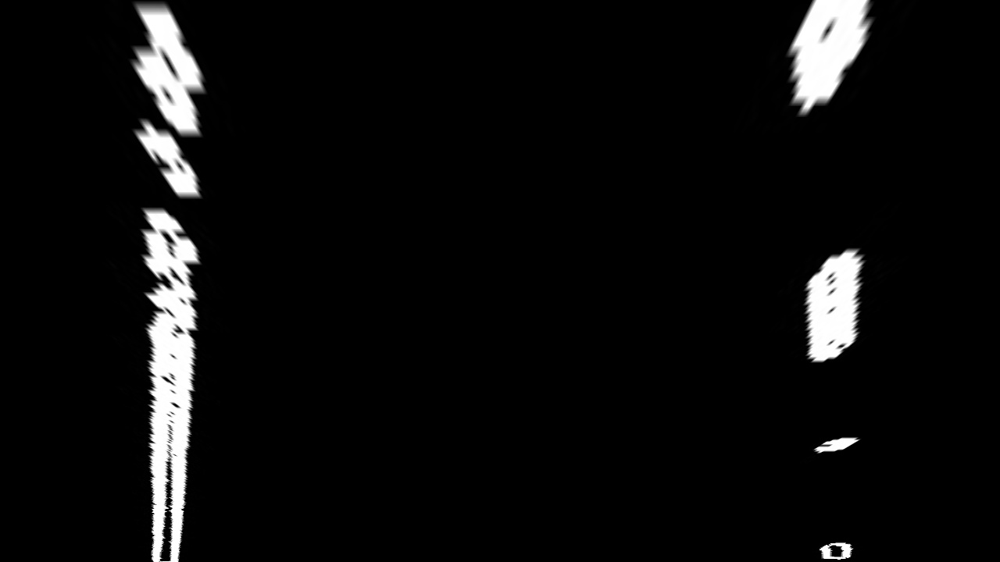

Jupyter Notebook
writeup_template
Last Checkpoint: a few seconds ago
(autosaved)
Current Kernel Logo
Python 3 
File
Edit
View
Insert
Cell
Kernel
Widgets
LaTeX_envs
Help
Autosave interval (min):

1
# Self-Driving Car Engineer Nanodegree
2
​
3
​
4
## Project: **Advanced Lane Lines on the Road** 
5
***
6
This is a CV based lane-marker detection and tracking implementation using standard OpenCV packages and advanced image processing functions. 
7
​
8
The entire pipeline is structured as follows. 
9
​
10
---
11
>**Advanced Lane Finding Project**
12
​
13
>The goals / steps of this project are the following:
14
​
15
>1. Camera Calibration
16
>    1. Compute the camera calibration matrix and distortion coefficients given a set of chessboard images
17
>    2. Apply a distortion correction to raw images
18
>2. Color Space & Gradient Processing
19
>    1. Use color transforms in HLS to extract useful color/level data   
20
>    2. Use gradients with Sobel operator and thresholding for a binary image
21
>    3. Apply a perspective transform to rectify binary image ("birds-eye view").
22
>4. Detect lane pixels and fit to find the lane boundary.
23
>     1. Determine the curvature of the lane and vehicle position with respect to center.
24
>     2. Warp the detected lane boundaries back onto the original image.
25
>     3. Output visual display of the lane boundaries and numerical estimation of lane curvature and vehicle position.  
26
>5. Video Processing Pipeline   
27
>     1. Image undistort
28
>     2. Color transform (use S-channel)
29
>     3. Gradient detector for edges
30
>     4. Perspective transform to dewarp camera image
31
>     5. Lane detect using historical tracking data
32
>     6. Calcualte curvature metrics
33
>     7. Warp back to original image geometry
34
***
35
​
36
​
37
## 1. Camera Calibration
38
​
39
Use checkerboard images to calibrate camera intrinsics. 
40
* Load reference calibration images
41
* Detect checkerboard corners for _valid_ images & calibrate camera sensor
42
* Undistort images using calibration matrix (instrinsics)
43
​
44
- - - - 
45
​
46
### 1.1 Camera Calibration & Distortion Correction
47
A sample calibration data frame used for camera matrix calculation. 
48
​
49

50
​
51
Checkerboard detection usign OpenCV library, the camera fundamental matrix and distortion transformations are derived. We test these on the sample images to get the undistorted frame. A sample is provided below. 
52
​
53

54
​
55
## 2. Color & Gradient Processing
56
The main task for this process pipeline is to extract the relevant lane-markers from the test images, the dominant colors for this selection being white & yelow.
57
​
58
After a suitable regio-of-interest mask and edge gradient thresholding, a bird's eye view is obtained by a warping transformation. The reason for this is to make it easier to detect and track lane marker lines across a camera frame by transforming the geometrically warped image into a rectangular view.    
59
​
60
### 2.1 Color Thresholding & Gradient Detection
61
The undistorted frames are then processed to pick up the white & yellow colors dominant in lane markers. Various color spaces were evaluated with a threshold selector for `RGB`, `HSV` and `Lab` color components.
62
​
63
A alternative color thresholding using `R` and `S` channels was also tried but the more robust 'white-yellow' color selector using the following thresholds was found ot be most robust. 
64
​
65
Using white & yellow thresholding on test images with the following component thresholds results in the following binary image for the sample test frame. 
66
​
67
| Color | Space | Min Threshold | Max Threshold |
68
|-:|-:|-:|-:|
69
|White|RGB|[100, 100, 200]|[255, 255, 255]|
70
|Yellow|RGB|[225, 180, 0]|[255, 255, 170]|
71
|Yellow|HLS|[20, 120, 130]|[45, 200, 255]|
72
|Yellow|Lab|[0, 0, 154]|[0, 0, 255]|
73
​
74

75
​
76
### 2.2 RoI Mask & Gradient Thresholding
77
The frames are then processed on the selected RoI that maximizes the probability of lane marker detection while reducing unnecessary processing on parts of the image that are not likely to contain any useful information. 
78
​
79
The gradient detectors used were evaluated from `sobel'` and `laplacian` operators with various kernel sizes. A separate absolute, magnitude and angular threshold selection was done across the thresholded image. 
80
​
81
The RoI selected and gradient thresholded image used for further processing is sampled below. 
82
​
83

84
​
85
### 2.3 De-warping with Perspective Transform
86
To aid in the lane marker detection, the gradient thresholded image is then de-warped using the camera distortion matrix computed in the earlier steps and `pickled`. 
87
​
88
For this process, we select a test image that shows the largest span of straight lane lines as below. 
89
​
90

91
​
92
These are then mapped to a rectangular pixel region to generate the de-warping transformation. Both the warp and inverse-warp (de-warp) transformations are `pickled` for further processing. This process is done just once per camera setup and hence not part of the pipeline process used for the video frames. 
93
​
94

95
​
96
The binary gradient thresholded frame is then warped using the same warp transformation computed above to provide a bird's-eye view of lane marker lines. 
97
​
98

99
​
100
## 3. Lane Boundary Detector
101
A couple of lane detector and tracking algorithms were tested based on the theory & practice covered in the course material. 
102
​
103
The primary lane marker detector before applying the searcher-tracker is asimple historgram peak search that picks out the lanes by detecting the two dominant peaks in the gradient thresholded image as shown below.
104
​
105

106
​
107
​
108
### 3.1 Sliding Window Tracker
109
The sliding window tracker first sets up a series of search window pairs, one each for left and the right lanes that split up the entire frame into a given number of horizontal slices. This limits the search region for each lane to a small rectangular area that can work robustly for curved lanes. 
110
​
111
All non-zero binary gradient thresholded pixels that lie within the search rectangle are marked as `lane` pixels. As the slices are scanned from bottom to top, the next slice window centers are adjusted to be the mean of the previous slice lane pixels, but only if the count exceed some minimum detection threshold. 
112
​
113
The number of slices, the thresholds and the search window dimensions are all tunable and have been chosen after some exploration of across the test image & video data set. 
114
​
115
A second order polynomial is fit through all detected left & right lane pixels to provide an anlytic expression of the lane markers. 
116
​
117
A sample window search with the rectangular search windows and the identified lane pixels and markers is shown below.
118
​
119

120
​
121
Using a search window around the previous frame's detected polynomial allows a much tighter and temporally correlated detection. The plot below shows in green the region of search which takes advantage of the temporal correlation between video frames and hence can be a whole lot tighter than a brute force blank search.
122
​
123
* Histogram peak line detect
124
* Line tracking over frame using sliding window & convolution search algorithm
125
* Measure curvature and car body center markers
126
​
127
>**Note**: Experiments with various lane weighting combinations were tried and the following method was used to `weigh` the relative importance of detected lane pixels while estimating the 2nd order polynomials used to define the left & right lane markers. 
128
> 1. Detected lane pixels *closer* to the camera (i.e. lower in the image frame) are weighted exponentially higher than those farther away. `scl_fct = np.log(nwindows-window)`
129
> 2. A higher confidence metric for a lane determines its weight when using the polynomial 2nd and 1st order coefficients. The *weaker* or less confident lane marker uses the average of its own and the dominant lane marker coefficients. 
130
​
131

132
​
133
​
134
### 3.2 Convolutional Search Tracker
135
The convolutional search algorithm on the other hand uses a mask to convolve the thresholded binary image with a window mask that shows peak where the mask and lane marker pixels coincide. 
136
​
137
Various order polynomials were tested with weighted centroids (i.e. selecting centroids where normalized convolution peak was a least 30%-tile of the centroids in all the selected search windows for each of left & right lanes). A final selection was made with 2nd order polynomials as below.   
138
​
139

140
​
141
### 3.3 Lane Marker Annotation
142
Once the lane markers are detected and modelled, the drivable surface can then be idnetified as the surface encompassing the left & right polynomials. The lanes & the surface can then be warped back to the original space using the `pickled` geometry inversion matrix. 
143
​
144
With the left & right lane polynomials evaluated, the radius of curvature is then computed in pixel & `km` domain. Other useful metrics such as deviation from center track can also be then annotated onto the frame. 
145
​
146

147
​
148
---
149
​
150
## 4. Video Pipeline Implementation
151
The video pipeline is then just a sequential function call of the various tuned implementations discussed above. These have been implemened in the jupyter notebook [here](.\VideoPipeline.ipynb)
152
​
153
The project test vidoe output processed from the pipeline is availabele [here](./Resources/test_videos_output/project_video.mp4)
154
​
155
---
156
​
157
## 5. Discussion
158
​
159
A few enhancements that can make the implementation more robust:
160
​
161
    1. A combined sliding window and convolution search dynamically selected when one fails to detect reliable lane markers. 
162
    2. Using a frame averaged lines from multiple previous frames. 
Self-Driving Car Engineer Nanodegree
Project: Advanced Lane Lines on the Road
This is a CV based lane-marker detection and tracking implementation using standard OpenCV packages and advanced image processing functions.

The entire pipeline is structured as follows.

Advanced Lane Finding Project

The goals / steps of this project are the following:

Camera Calibration
Compute the camera calibration matrix and distortion coefficients given a set of chessboard images
Apply a distortion correction to raw images
Color Space & Gradient Processing
Use color transforms in HLS to extract useful color/level data
Use gradients with Sobel operator and thresholding for a binary image
Apply a perspective transform to rectify binary image ("birds-eye view").
Detect lane pixels and fit to find the lane boundary.
Determine the curvature of the lane and vehicle position with respect to center.
Warp the detected lane boundaries back onto the original image.
Output visual display of the lane boundaries and numerical estimation of lane curvature and vehicle position.
Video Processing Pipeline
Image undistort
Color transform (use S-channel)
Gradient detector for edges
Perspective transform to dewarp camera image
Lane detect using historical tracking data
Calcualte curvature metrics
Warp back to original image geometry
1. Camera Calibration
Use checkerboard images to calibrate camera intrinsics.

Load reference calibration images
Detect checkerboard corners for valid images & calibrate camera sensor
Undistort images using calibration matrix (instrinsics)
1.1 Camera Calibration & Distortion Correction
A sample calibration data frame used for camera matrix calculation.

Calibration Data Frame
Checkerboard detection usign OpenCV library, the camera fundamental matrix and distortion transformations are derived. We test these on the sample images to get the undistorted frame. A sample is provided below.

Undistorted Test Image
2. Color & Gradient Processing
The main task for this process pipeline is to extract the relevant lane-markers from the test images, the dominant colors for this selection being white & yelow.

After a suitable regio-of-interest mask and edge gradient thresholding, a bird's eye view is obtained by a warping transformation. The reason for this is to make it easier to detect and track lane marker lines across a camera frame by transforming the geometrically warped image into a rectangular view.

2.1 Color Thresholding & Gradient Detection
The undistorted frames are then processed to pick up the white & yellow colors dominant in lane markers. Various color spaces were evaluated with a threshold selector for RGB, HSV and Lab color components.

A alternative color thresholding using R and S channels was also tried but the more robust 'white-yellow' color selector using the following thresholds was found ot be most robust.

Using white & yellow thresholding on test images with the following component thresholds results in the following binary image for the sample test frame.

Color	Space	Min Threshold	Max Threshold
White	RGB	[100, 100, 200]	[255, 255, 255]
Yellow	RGB	[225, 180, 0]	[255, 255, 170]
Yellow	HLS	[20, 120, 130]	[45, 200, 255]
Yellow	Lab	[0, 0, 154]	[0, 0, 255]
Binary Thresholded Test Image
2.2 RoI Mask & Gradient Thresholding
The frames are then processed on the selected RoI that maximizes the probability of lane marker detection while reducing unnecessary processing on parts of the image that are not likely to contain any useful information.

The gradient detectors used were evaluated from sobel' and laplacian operators with various kernel sizes. A separate absolute, magnitude and angular threshold selection was done across the thresholded image.

The RoI selected and gradient thresholded image used for further processing is sampled below.

Gradient Threhsolded Test Image
2.3 De-warping with Perspective Transform
To aid in the lane marker detection, the gradient thresholded image is then de-warped using the camera distortion matrix computed in the earlier steps and pickled.

For this process, we select a test image that shows the largest span of straight lane lines as below.

Straight Line Marked Test Image
These are then mapped to a rectangular pixel region to generate the de-warping transformation. Both the warp and inverse-warp (de-warp) transformations are pickled for further processing. This process is done just once per camera setup and hence not part of the pipeline process used for the video frames.

Warped (Bird's-eye View) Test Image
The binary gradient thresholded frame is then warped using the same warp transformation computed above to provide a bird's-eye view of lane marker lines.

Warped (Bird's-eye View) Gradient Test Image
3. Lane Boundary Detector
A couple of lane detector and tracking algorithms were tested based on the theory & practice covered in the course material.

The primary lane marker detector before applying the searcher-tracker is asimple historgram peak search that picks out the lanes by detecting the two dominant peaks in the gradient thresholded image as shown below.

Warped Lane Histogram (bottom 1/4th)
3.1 Sliding Window Tracker
The sliding window tracker first sets up a series of search window pairs, one each for left and the right lanes that split up the entire frame into a given number of horizontal slices. This limits the search region for each lane to a small rectangular area that can work robustly for curved lanes.

All non-zero binary gradient thresholded pixels that lie within the search rectangle are marked as lane pixels. As the slices are scanned from bottom to top, the next slice window centers are adjusted to be the mean of the previous slice lane pixels, but only if the count exceed some minimum detection threshold.

The number of slices, the thresholds and the search window dimensions are all tunable and have been chosen after some exploration of across the test image & video data set.

A second order polynomial is fit through all detected left & right lane pixels to provide an anlytic expression of the lane markers.

A sample window search with the rectangular search windows and the identified lane pixels and markers is shown below.

Sliding Window Lane-marker Search
Using a search window around the previous frame's detected polynomial allows a much tighter and temporally correlated detection. The plot below shows in green the region of search which takes advantage of the temporal correlation between video frames and hence can be a whole lot tighter than a brute force blank search.

Histogram peak line detect
Line tracking over frame using sliding window & convolution search algorithm
Measure curvature and car body center markers
Note: Experiments with various lane weighting combinations were tried and the following method was used to weigh the relative importance of detected lane pixels while estimating the 2nd order polynomials used to define the left & right lane markers.

Detected lane pixels closer to the camera (i.e. lower in the image frame) are weighted exponentially higher than those farther away. scl_fct = np.log(nwindows-window)
A higher confidence metric for a lane determines its weight when using the polynomial 2nd and 1st order coefficients. The weaker or less confident lane marker uses the average of its own and the dominant lane marker coefficients.
Sliding Window Lane-marker Search (with history)
3.2 Convolutional Search Tracker
The convolutional search algorithm on the other hand uses a mask to convolve the thresholded binary image with a window mask that shows peak where the mask and lane marker pixels coincide.

Various order polynomials were tested with weighted centroids (i.e. selecting centroids where normalized convolution peak was a least 30%-tile of the centroids in all the selected search windows for each of left & right lanes). A final selection was made with 2nd order polynomials as below.

Convolutional Lane-marker Search
3.3 Lane Marker Annotation
Once the lane markers are detected and modelled, the drivable surface can then be idnetified as the surface encompassing the left & right polynomials. The lanes & the surface can then be warped back to the original space using the pickled geometry inversion matrix.

With the left & right lane polynomials evaluated, the radius of curvature is then computed in pixel & km domain. Other useful metrics such as deviation from center track can also be then annotated onto the frame.

Annotated Lane-marker Detection
4. Video Pipeline Implementation
The video pipeline is then just a sequential function call of the various tuned implementations discussed above. These have been implemened in the jupyter notebook here

The project test vidoe output processed from the pipeline is availabele here

5. Discussion
A few enhancements that can make the implementation more robust:

1. A combined sliding window and convolution search dynamically selected when one fails to detect reliable lane markers. 
2. Using a frame averaged lines from multiple previous frames. 

